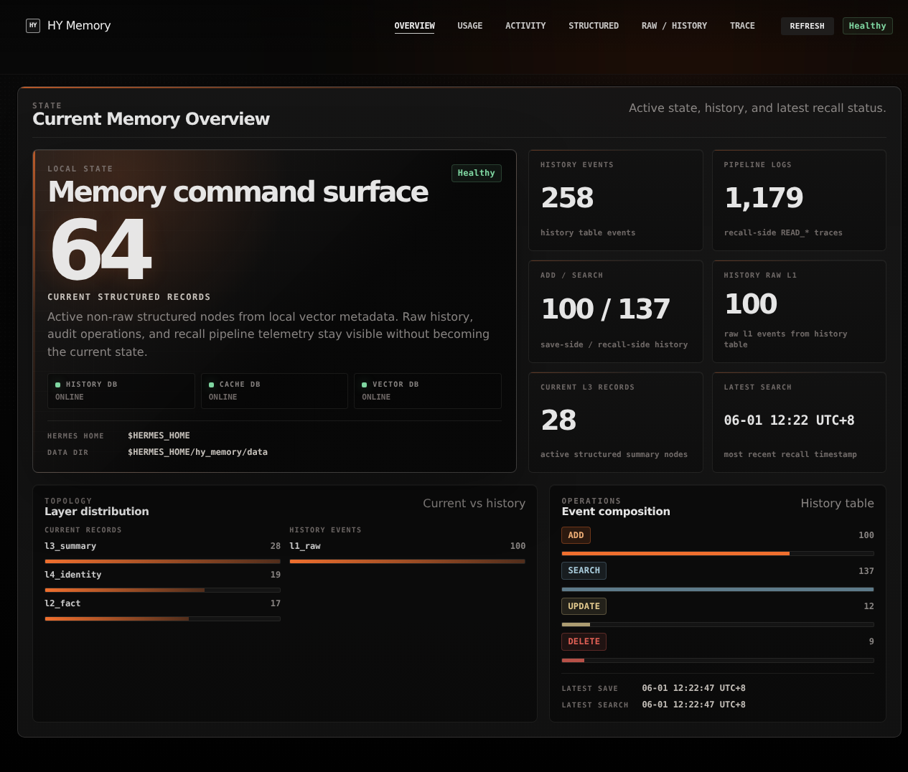
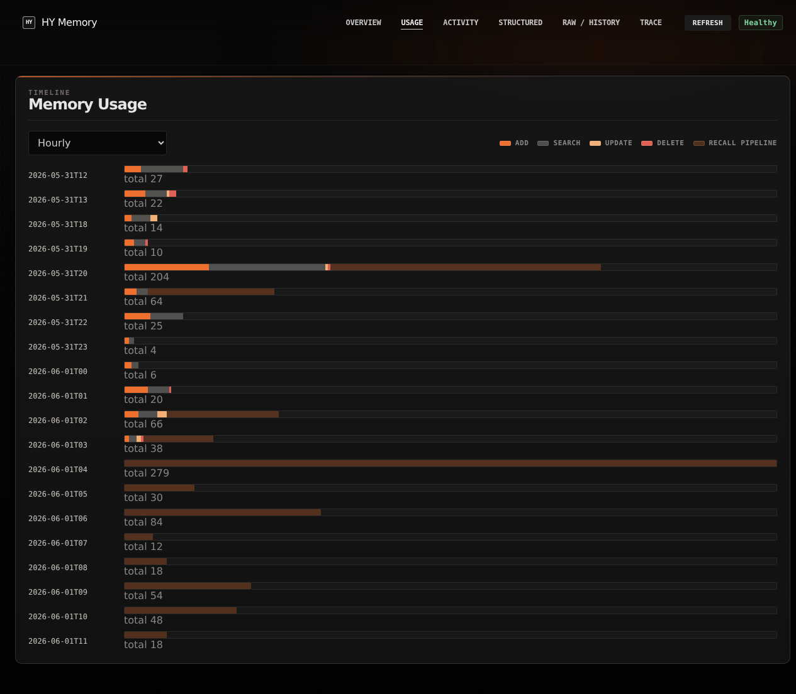
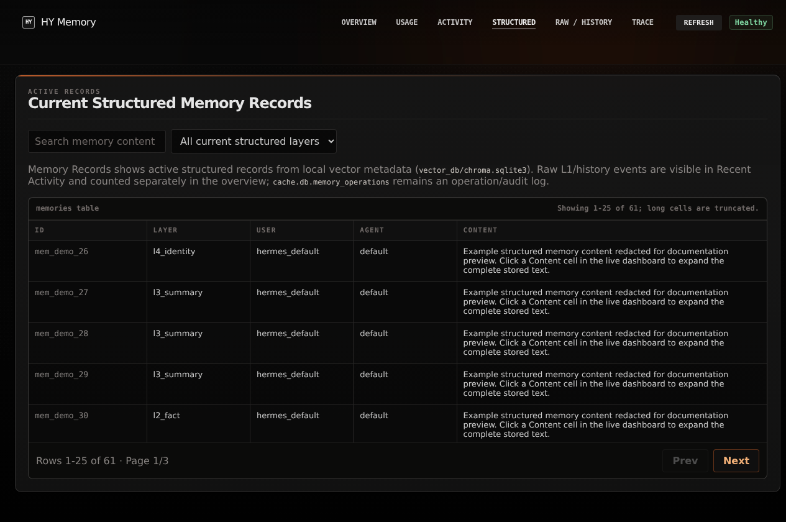

# Hermes HY Memory Provider

Hermes HY Memory Provider is a single Hermes Agent memory-provider plugin for the `hy-memory` Python SDK. It provides automatic recall/capture plus the explicit aggregate `hy_memory(action=...)` tool without requiring a separate default MCP server.

## What is included

- Hermes provider entrypoint: `__init__.py`
- Profile-scoped non-secret config: `$HERMES_HOME/hy_memory.json`
- Managed isolated HY Memory runtime support: `runtime.py` plus `hy_memory_worker.py`
- Hermes-hosted LLM routing adapter: `hermes_llm.py`
- HY Memory SDK LLMProvider injection: `hy_memory_llm_patch.py`
- SDK/worker adapter around `hy_memory.HyMemoryClient`: `client_adapter.py`
- Tool: `hy_memory(action="add|search|get|update|delete|list|status")`
- Bundled curation skill: `hy_memory:hy-memory-curation`
- Background prefetch/capture lifecycle hooks
- Developer CLI and optional smoke test

## Install for local development

From this repository:

```bash
bash scripts/install_dev.sh
hermes plugins enable hy_memory
hermes config set memory.provider hy_memory
```

After enabling the plugin, changing provider config, or changing `$HERMES_HOME/.env`, restart Hermes Agent or start a new/reset session so the memory provider, tools, and bundled skill registry are reloaded.

## Bundled memory-curation skill

The plugin ships `hy_memory:hy-memory-curation`, adapted from the EverOS-Hermes curation skill. Load it when you want Hermes to proactively decide whether a complex task produced durable memory, a reusable skill, a local note, or no save at all:

```text
/skill hy_memory:hy-memory-curation
```

Plugin-bundled skills are qualified-only in the current Hermes Agent plugin model. `hy_memory:hy-memory-curation` can load by qualified name even when ordinary `skills_list` or `hermes skills list` output does not show it; this plugin surfaces the qualified load path in `hy_memory(action="status")` and the system prompt instead of modifying Hermes Agent core.

The skill also documents HY Memory-specific behavior: successful `hy_memory(action="add")` calls may remain as `l1_raw`, while `hy_memory(action="search")` and `hy_memory(action="list")` mainly return structured layers such as identity/profile/normal memories. For live search smoke tests, use durable-looking preference or identity facts and keep cleanup intent in metadata, then delete the isolated test scope.

## Runtime architecture

Default runtime mode is `managed_venv`. In that mode the Hermes plugin keeps Hermes Agent clean and runs HY Memory SDK dependencies in a profile-scoped Python environment:

```text
Hermes Agent process
  -> hy_memory plugin
  -> JSONL worker subprocess
      -> $HERMES_HOME/hy_memory/runtime/venv
      -> hy-memory, chromadb, kuzu, scikit-learn, etc.
```

The worker owns `hy-memory`/Chroma/Kuzu imports. When HY Memory needs an LLM call, the worker sends a JSONL `llm_request` callback to the parent plugin; the parent calls Hermes Agent's existing `agent.auxiliary_client.async_call_llm(task="hy_memory")` path and returns the normalized result. This preserves Hermes provider routing, OAuth-backed providers such as `openai-codex`, auxiliary model config, and model overrides while keeping heavy memory dependencies outside the Hermes runtime.

The managed runtime is created on first real backend use when `runtime.auto_install` is `true`. Shallow `status` and plugin discovery do not create venvs, install packages, or import the HY Memory SDK. If you need the previous development behavior, set `runtime.mode` to `in_process`; that requires `hy-memory` to be importable in the Hermes Python environment and is mainly a rollback/development path.

## Configuration split

| Location | Owner | Contents |
|---|---|---|
| `$HERMES_HOME/hy_memory.json` | This plugin | HY Memory mode, runtime mode, recall/capture settings, vector store, direct embedder settings, and direct LLM settings only when `llm.mode` is `direct` |
| `$HERMES_HOME/hy_memory/runtime/venv` | This plugin | Managed Python runtime containing `hy-memory` and transitive dependencies such as `chromadb` |
| `$HERMES_HOME/config.yaml` | Hermes Agent | Active provider/model and optional `auxiliary.hy_memory` overrides used by the default Hermes-hosted memory LLM |
| `$HERMES_HOME/.env` | Hermes Agent | `MEMORY_EMBEDDER_API_KEY`; `MEMORY_LLM_API_KEY` only when `llm.mode` is `direct` |

Default mode is `llm.mode = "hermes"`. In that mode HY Memory extraction calls route through Hermes Agent's existing model path via `agent.auxiliary_client.async_call_llm(task="hy_memory")`; the plugin does not store or read a separate LLM API key. Configure the model with Hermes itself:

```bash
hermes config set auxiliary.hy_memory.provider auto
hermes config set auxiliary.hy_memory.timeout 60
```

For an explicit auxiliary model endpoint:

```bash
hermes config set auxiliary.hy_memory.provider openrouter
hermes config set auxiliary.hy_memory.model tencent/hy3-preview
hermes config set auxiliary.hy_memory.base_url https://openrouter.ai/api/v1
```

For OpenAI Codex routing through Hermes, configure the auxiliary task with Hermes provider/model settings, for example `openai-codex` and the desired Codex model. The worker will still call back into Hermes instead of reading a separate LLM key.

Embeddings are direct OpenAI-compatible API calls because Hermes Agent does not expose a general embedding router. Put the embedder key in `$HERMES_HOME/.env`:

```env
MEMORY_EMBEDDER_API_KEY=<set in operator environment>
```

## Initialize or inspect config

Create a normalized `hy_memory.json` with the recommended isolated runtime:

```bash
python cli.py init --hermes-home "$HERMES_HOME" --llm-mode hermes --runtime-mode managed_venv --runtime-auto-install true --embedder-provider openai --embedder-model BAAI/bge-m3 --embedder-base-url https://api.siliconflow.cn/v1 --embedder-dims 1024 --vector-store chroma --collection-name hermes_memories --non-interactive
```

Use in-process mode only for development or rollback:

```bash
python cli.py config set runtime.mode in_process --hermes-home "$HERMES_HOME"
```

Show redacted resolved config:

```bash
python cli.py config show --hermes-home "$HERMES_HOME"
```

Set an allowed dotted path:

```bash
python cli.py config set embedder.model BAAI/bge-m3 --hermes-home "$HERMES_HOME"
python cli.py config set runtime.auto_install false --hermes-home "$HERMES_HOME"
```

## Typical non-secret config

```json
{
  "mode": "pro",
  "auto_recall": true,
  "auto_capture": true,
  "user_id": "hermes_default",
  "agent_id": "{identity}",
  "top_k": 10,
  "min_score": 0.4,
  "runtime": {
    "mode": "managed_venv",
    "venv_path": "hy_memory/runtime/venv",
    "package": "hy-memory",
    "auto_install": true
  },
  "llm": {
    "mode": "hermes",
    "task": "hy_memory",
    "temperature": 0.2,
    "max_tokens": 1024,
    "timeout": 60
  },
  "embedder": {
    "provider": "openai",
    "model": "BAAI/bge-m3",
    "base_url": "https://api.siliconflow.cn/v1",
    "embedding_dims": 1024
  },
  "vector_store": {
    "provider": "chroma",
    "collection_name": "hermes_memories"
  }
}
```

## OpenClaw field mapping

The plugin accepts common OpenClaw-style camelCase config and stores snake_case internally.

| OpenClaw key | Internal key |
|---|---|
| `autoRecall` | `auto_recall` |
| `autoCapture` | `auto_capture` |
| `topK` | `top_k` |
| `minScore` | `min_score` |
| `llm.baseUrl` | `llm.base_url` |
| `embedder.baseUrl` | `embedder.base_url` |
| `embedder.dims` | `embedder.embedding_dims` |
| `vectorStore` | `vector_store` |
| `collectionName` | `collection_name` |
| `persistDirectory` | `persist_directory` |
| `runtime.venvPath` | `runtime.venv_path` |
| `runtime.autoInstall` | `runtime.auto_install` |
| `runtime.workerScript` | `runtime.worker_script` |
| `llm.apiKey`, `embedder.apiKey` | env only; never written to `hy_memory.json` |

## Verify

Run the unit suite:

```bash
pytest -q
```

Check local-only provider status without requiring backend calls or runtime installation:

```bash
python cli.py status --hermes-home "$HERMES_HOME"
```

Run explicit deep status checks when the runtime and credentials are configured. Deep status inspects managed runtime paths and Hermes LLM routing, but it does not silently install missing packages. If the managed runtime is installed and the SDK is importable, deep status starts the worker and performs real vector/embedder health checks; otherwise it reports precise skipped reasons such as `runtime_not_installed` or `sdk_missing`:

```bash
python cli.py status --deep --hermes-home "$HERMES_HOME"
```

Run the optional real-backend smoke. It exits successfully with `SKIP` when the current Python environment lacks `hy_memory` or required backend configuration. Partial add results are treated as failures, not searchable success, and the script always attempts scoped cleanup:

```bash
python scripts/smoke_hy_memory.py --skip-if-unconfigured --hermes-home "$HERMES_HOME"
python scripts/smoke_hy_memory.py --skip-if-unconfigured --deep --hermes-home "$HERMES_HOME"
```

## Local dashboard

Run the local read-only dashboard when you want to inspect saved memory and recall activity in a browser without starting a memory worker or writing any records. After normal Hermes plugin installation, run it from the installed plugin path, not from the development repository:

```bash
PLUGIN_CLI="${HERMES_HOME:-$HOME/.hermes}/plugins/hy_memory/cli.py"
python "$PLUGIN_CLI" dashboard --hermes-home "${HERMES_HOME:-$HOME/.hermes}" --host 127.0.0.1 --port 18999
```

For local development only, the same command may be run against this repository's `cli.py`.

Then open:

```text
http://127.0.0.1:18999
```

The dashboard is read-only and localhost-only. It exposes GET-only local API endpoints for overview, usage, activity, current structured memories, raw/history records, trace, and health, including `/api/history-records` for the Raw / History Memory Records view. It does not add, update, delete, import, export, or forget memories. The browser UI uses a sticky top navigation to switch between Overview, Usage, Recent Activity, Current Structured Memory Records, Raw / History Memory Records, and Trace instead of rendering all long tables on one page. The Overview page uses a command-surface overview layout with a large structured-record status surface, database health rail, telemetry matrix, layer distribution, and event composition panels. Activity, current structured records, and raw/history records are paginated at 25 rows per page, and long table cells are line-clamped/truncated with full values kept in tooltips where practical; Recent Activity KIND and Raw / History EVENT use type-colored KIND/EVENT badges so ADD, SEARCH, UPDATE, DELETE, and recall pipeline rows are visually distinct; on Current Structured Memory Records and Raw / History Memory Records, click a Content cell to expand that specific cell to its full content and click it again to collapse back to the truncated preview.

### Dashboard screenshots

The screenshots below show the local read-only dashboard with public-safe placeholder paths/content where needed.







Dashboard data sources:

- `history.db.memory_history`: ADD, SEARCH, UPDATE, DELETE history, latest save/recall timestamps, and the Raw / History Memory Records table. This view exposes raw `l1_raw` rows and historical structured rows when they exist. The overview shows `History raw L1` from this history table separately from `Current L3 records`, which comes from active vector metadata, so historical zero states do not look like current structured-record mismatches.
- `vector_db/chroma.sqlite3`: local active vector metadata for Current Structured Memory Records. The current-record table reads active non-`l1_raw` structured nodes such as `l3_*` from Chroma metadata, so shadowed UPDATE predecessors and raw L1 nodes do not appear as current records.
- `cache.db.memory_operations`: operation/audit log for save-side ADD/UPDATE/SUPERSEDE activity. These rows remain visible through Recent Activity and trace context, but they are not used as current structured memory state.
- `cache.db.pipeline_logs`: recall pipeline steps such as `READ_*`, request ids, result ids, and elapsed time.
- `cache.db.system_metrics`: local runtime metric snapshots.

ADD, UPDATE, and DELETE are save-side activity. SEARCH and `READ_*` pipeline rows are recall-side activity. The dashboard reads those existing SQLite files with read-only connections and does not create a new database or cache.

## Tool result contracts

- `hy_memory(action="add")` returns `success=false`, `partial_success=true`, `memory_id/raw_memory_id`, and `searchable=false` when HY Memory stores a raw record but LLM/backend extraction fails. Treat that as a partial failure and clean up the raw id if needed.
- Successful string adds may include `structured_memory_ids`, `structured_count`, and `searchable`. Use these structured ids, or ids returned by `hy_memory(action="search")`/`hy_memory(action="list")`, for `hy_memory(action="update")`.
- Raw ids returned directly by add are storage records for `hy_memory(action="get")` and cleanup. They are not structured recall ids; `hy_memory(action="update")` rejects raw/shadow ids with `error_code="raw_id_not_structured"`.
- `hy_memory(action="list")` accepts `session_id` and applies it as a tool-side post-filter over SDK list payloads.

## Notes

- `reference/` is a local ignored cache of upstream `openclaw-hy-memory` and `hy-memory` artifacts. It is not part of the plugin source.
- The implementation reuses upstream behavior at the interface level: HY Memory SDK calls stay behind `client_adapter.py`, OpenClaw-style grouped search results are normalized, and tool safety semantics are preserved behind the aggregate `hy_memory(action=...)` tool.
- Managed runtime isolation follows the OpenClaw venv idea but keeps the Hermes plugin as the single integration point and preserves Hermes-hosted LLM provider routing through the parent-process JSONL callback bridge.
- Automatic capture is disabled for Hermes `agent_context` values `cron`, `flush`, and `subagent` to avoid polluting primary user memory.
